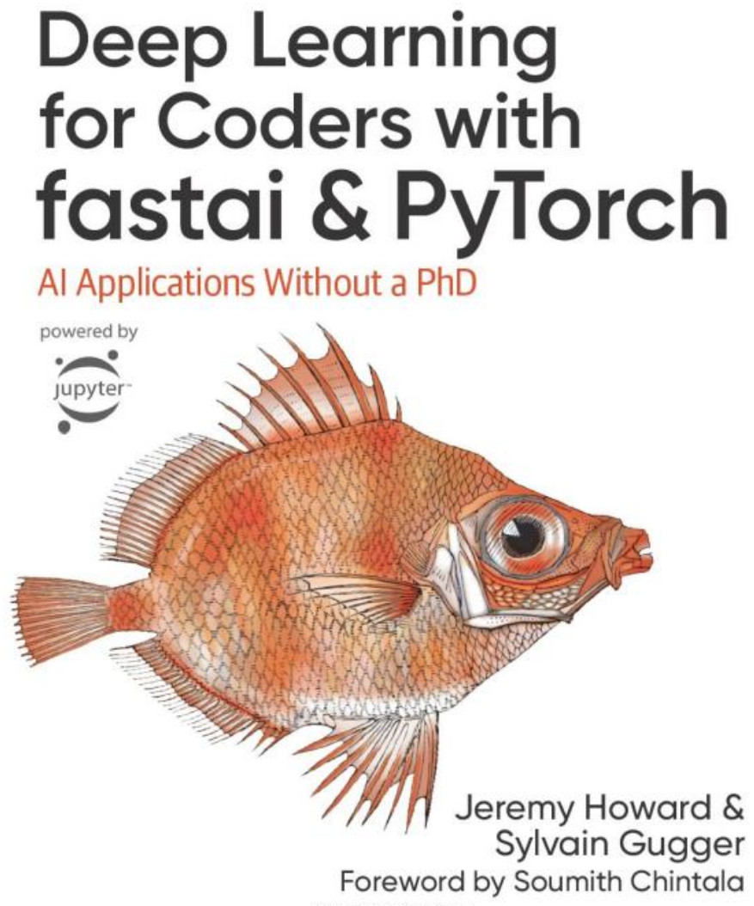

::: {layout="[30,70]"}

[Deep Learning for Coders with Fastai and PyTorch: AI Applications Without a PhD](https://www.amazon.com/Deep-Learning-Coders-fastai-PyTorch/dp/1492045527) is the book that forms the basis for this course. We recommend reading the book as you complete the course. There's a few ways to read the book -- you can buy it as a paper book or Kindle ebook, or you can read it for free as a Jupyter notebook. The whole book is written as Jupyter notebooks, so you can also execute all the code in the book yourself.  To go to the interactive Jupyter version of any chapter, click any of the chapter links in the [Colab](#Colab) section immediately below. If you just want to read the book, without interacting with the code, jump to the [nbviewer](#nbviewer) section.

:::

## Colab

[Google Colab](https://colab.research.google.com/) is a free (with paid subscription option) platform for running Jupyter Notebooks in the cloud. You can open any chapter of the book in Colab by clicking on one of these links:

- [Chapter 1, Intro](https://colab.research.google.com/github/fastai/fastbook/blob/master/01_intro.ipynb)
- [Chapter 2, Production](https://colab.research.google.com/github/fastai/fastbook/blob/master/02_production.ipynb)
- [Chapter 3, Ethics](https://colab.research.google.com/github/fastai/fastbook/blob/master/03_ethics.ipynb)
- [Chapter 4, MNIST Basics](https://colab.research.google.com/github/fastai/fastbook/blob/master/04_mnist_basics.ipynb)
- [Chapter 5, Pet Breeds](https://colab.research.google.com/github/fastai/fastbook/blob/master/05_pet_breeds.ipynb)
- [Chapter 6, Multi-Category](https://colab.research.google.com/github/fastai/fastbook/blob/master/06_multicat.ipynb)
- [Chapter 7, Sizing and TTA](https://colab.research.google.com/github/fastai/fastbook/blob/master/07_sizing_and_tta.ipynb)
- [Chapter 8, Collab](https://colab.research.google.com/github/fastai/fastbook/blob/master/08_collab.ipynb)
- [Chapter 9, Tabular](https://colab.research.google.com/github/fastai/fastbook/blob/master/09_tabular.ipynb)
- [Chapter 10, NLP](https://colab.research.google.com/github/fastai/fastbook/blob/master/10_nlp.ipynb)
- [Chapter 11, Mid-Level API](https://colab.research.google.com/github/fastai/fastbook/blob/master/11_midlevel_data.ipynb)
- [Chapter 12, NLP Deep-Dive](https://colab.research.google.com/github/fastai/fastbook/blob/master/12_nlp_dive.ipynb)
- [Chapter 13, Convolutions](https://colab.research.google.com/github/fastai/fastbook/blob/master/13_convolutions.ipynb)
- [Chapter 14, Resnet](https://colab.research.google.com/github/fastai/fastbook/blob/master/14_resnet.ipynb)
- [Chapter 15, Arch Details](https://colab.research.google.com/github/fastai/fastbook/blob/master/15_arch_details.ipynb)
- [Chapter 16, Optimizers and Callbacks](https://colab.research.google.com/github/fastai/fastbook/blob/master/16_accel_sgd.ipynb)
- [Chapter 17, Foundations](https://colab.research.google.com/github/fastai/fastbook/blob/master/17_foundations.ipynb)
- [Chapter 18, GradCAM](https://colab.research.google.com/github/fastai/fastbook/blob/master/18_CAM.ipynb)
- [Chapter 19, Learner](https://colab.research.google.com/github/fastai/fastbook/blob/master/19_learner.ipynb)
- [Chapter 20, Conclusion](https://colab.research.google.com/github/fastai/fastbook/blob/master/20_conclusion.ipynb)

## nbviewer

[nbviewer](https://nbviewer.org/) is a free platform for reading Jupyter Notebooks. You can open any chapter of the book in nbviewer by clicking on one of these links:

- [Chapter 1, Intro](https://nbviewer.org/github/fastai/fastbook/blob/master/01_intro.ipynb)
- [Chapter 2, Production](https://nbviewer.org/github/fastai/fastbook/blob/master/02_production.ipynb)
- [Chapter 3, Ethics](https://nbviewer.org/github/fastai/fastbook/blob/master/03_ethics.ipynb)
- [Chapter 4, MNIST Basics](https://nbviewer.org/github/fastai/fastbook/blob/master/04_mnist_basics.ipynb)
- [Chapter 5, Pet Breeds](https://nbviewer.org/github/fastai/fastbook/blob/master/05_pet_breeds.ipynb)
- [Chapter 6, Multi-Category](https://nbviewer.org/github/fastai/fastbook/blob/master/06_multicat.ipynb)
- [Chapter 7, Sizing and TTA](https://nbviewer.org/github/fastai/fastbook/blob/master/07_sizing_and_tta.ipynb)
- [Chapter 8, Collab](https://nbviewer.org/github/fastai/fastbook/blob/master/08_collab.ipynb)
- [Chapter 9, Tabular](https://nbviewer.org/github/fastai/fastbook/blob/master/09_tabular.ipynb)
- [Chapter 10, NLP](https://nbviewer.org/github/fastai/fastbook/blob/master/10_nlp.ipynb)
- [Chapter 11, Mid-Level API](https://nbviewer.org/github/fastai/fastbook/blob/master/11_midlevel_data.ipynb)
- [Chapter 12, NLP Deep-Dive](https://nbviewer.org/github/fastai/fastbook/blob/master/12_nlp_dive.ipynb)
- [Chapter 13, Convolutions](https://nbviewer.org/github/fastai/fastbook/blob/master/13_convolutions.ipynb)
- [Chapter 14, Resnet](https://nbviewer.org/github/fastai/fastbook/blob/master/14_resnet.ipynb)
- [Chapter 15, Arch Details](https://nbviewer.org/github/fastai/fastbook/blob/master/15_arch_details.ipynb)
- [Chapter 16, Optimizers and Callbacks](https://nbviewer.org/github/fastai/fastbook/blob/master/16_accel_sgd.ipynb)
- [Chapter 17, Foundations](https://nbviewer.org/github/fastai/fastbook/blob/master/17_foundations.ipynb)
- [Chapter 18, GradCAM](https://nbviewer.org/github/fastai/fastbook/blob/master/18_CAM.ipynb)
- [Chapter 19, Learner](https://nbviewer.org/github/fastai/fastbook/blob/master/19_learner.ipynb)
- [Chapter 20, Conclusion](https://nbviewer.org/github/fastai/fastbook/blob/master/20_conclusion.ipynb)

